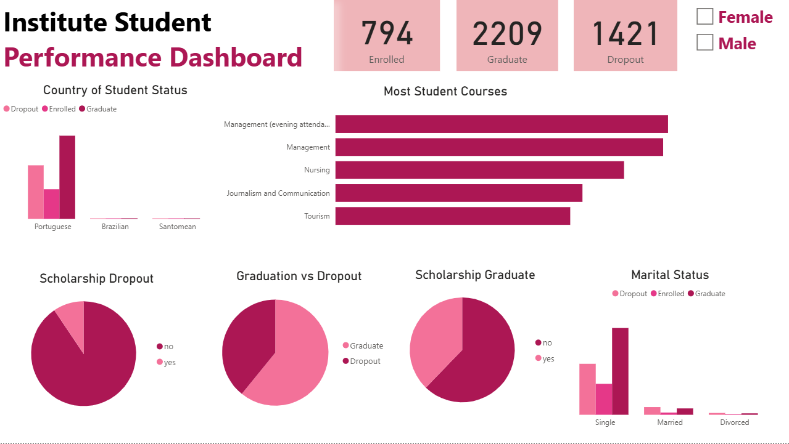

# Proyek Akhir Data Science
## Business Understanding:
Jaya Jaya Institut merupakan institusi pendidikan tinggi yang telah berdiri sejak tahun 2000 dan telah mencetak banyak lulusan berkualitas. Meskipun memiliki reputasi baik, data internal menunjukkan bahwa tingkat dropout (mahasiswa yang tidak menyelesaikan pendidikan) masih cukup tinggi. Fenomena ini tentu menjadi perhatian serius karena dropout tidak hanya berdampak pada reputasi institusi, tetapi juga pada efektivitas proses pendidikan dan efisiensi sumber daya.

Untuk itu, Jaya Jaya Institut berinisiatif menggunakan data science untuk memahami dan menganalisis pola dropout, sehingga dapat mendeteksi lebih awal potensi mahasiswa yang berisiko tinggi keluar dari institusi, dan memberikan bimbingan khusus untuk meningkatkan retensi mahasiswa.
## Permasalahan Bisnis:
- Institusi pendidikan kesulitan dalam mengenali faktor-faktor signifikan yang memengaruhi keputusan mahasiswa untuk keluar dari studi.
- Belum tersedia sistem dashboard interaktif yang mampu memantau status akademik mahasiswa secara real-time.
- Minimnya strategi berbasis data yang terarah dalam menekan angka dropout dan meningkatkan tingkat kelulusan mahasiswa.
## Cakupan Proyek:
- Mengidentifikasi faktor penyebab utama tingginya angka dropout.
- Menganalisis hubungan antara beasiswa, status pernikahan, jurusan, dan asal negara terhadap kelulusan.
- Mengembangkan dashboard bisnis untuk memantau data mahasiswa secara visual dan real-time.
## Persiapan:
### Sumber data : [https://raw.githubusercontent.com/dicodingacademy/dicoding_dataset/main/employee/employee_data.csv](https://github.com/dicodingacademy/dicoding_dataset/blob/main/students_performance/README.md)
### Setup Environment - Anaconda:
- conda create --name main-ds python=3.9
- conda activate main-ds
- pip install -r requirements.txt
### Setup Environment - Shell/Terminal:
- mkdir proyek_akhir
- cd proyek_akhir
- pipenv install
- pipenv shell
- pip install -r requirements.txt
### Run steamlit app
https://drive.google.com/file/d/1AjCuyQ53M_FF4IyfzRFdGgzTDbart94W/view?usp=sharing
## Business Dashboard
https://drive.google.com/file/d/1AjCuyQ53M_FF4IyfzRFdGgzTDbart94W/view?usp=sharing

Insight Berdasarkan Data:
- Asal Mahasiswa: Mayoritas mahasiswa berasal dari Portugal, dan sebagian besar yang dropout juga berasal dari negara ini.
- Jurusan Terpopuler: Jurusan dengan jumlah mahasiswa terbanyak adalah Manajemen (terutama kelas malam) dan Keperawatan, yang juga memiliki proporsi dropout tinggi.
- Beasiswa dan Dropout: Mahasiswa penerima beasiswa cenderung lebih rendah tingkat dropout-nya. Hal ini mengindikasikan bahwa beasiswa mungkin berperan sebagai motivasi untuk menyelesaikan studi.
- Status Pernikahan: Mahasiswa lajang memiliki jumlah dropout dan kelulusan yang tinggi, sedangkan yang menikah atau bercerai jumlahnya sedikit, namun tetap terdapat dropout dari kelompok ini.
- Gender: Berdasarkan warna visual, data dapat dipilah berdasarkan gender, meskipun belum ditampilkan secara eksplisit pada pie chart atau bar chart.

## Menjalankan Sistem Machine Learning
Pada proyek ini telah disediakan sebuah prototype untuk melakukan prediksi terhadap model yang sudah dibuat. Untuk menjalankan protoype secara lokal jalankan perintah berikut di terminal: streamlit run app.py
Atau buka pada tautan ini: https://proyek-akhir-gyxnsxygmdewu5myqeykzc.streamlit.app/

## Conclusion
Berdasarkan analisis data yang ditampilkan melalui dashboard kinerja mahasiswa Jaya Jaya Institut, dapat disimpulkan bahwa permasalahan tingkat dropout yang tinggi masih menjadi tantangan signifikan bagi institusi. Mahasiswa yang berasal dari Portugal merupakan kelompok terbanyak baik dari segi kelulusan maupun angka dropout, yang menunjukkan bahwa faktor asal negara dapat memiliki keterkaitan tertentu dengan keberhasilan studi. Selain itu, jurusan-jurusan dengan jumlah mahasiswa terbanyak seperti Manajemen (terutama kelas malam) dan Keperawatan juga menunjukkan proporsi dropout yang cukup tinggi, yang mungkin mengindikasikan adanya tekanan akademik atau beban studi yang berat di program-program tersebut.

Faktor beasiswa pun tampak memainkan peran penting dalam memengaruhi keberhasilan studi mahasiswa. Dari data terlihat bahwa mahasiswa penerima beasiswa cenderung memiliki tingkat dropout yang lebih rendah dibandingkan mereka yang tidak menerima beasiswa. Hal ini menunjukkan bahwa dukungan finansial yang diberikan institusi dapat menjadi motivasi tambahan bagi mahasiswa untuk menyelesaikan pendidikannya. Di sisi lain, status pernikahan mahasiswa juga tampaknya memiliki hubungan tertentu terhadap keberhasilan studi, di mana mahasiswa yang berstatus lajang tercatat sebagai kelompok dengan jumlah dropout tertinggi, mungkin karena mereka kurang memiliki dukungan emosional atau ekonomi selama proses pendidikan. Dengan memahami berbagai faktor ini, Jaya Jaya Institut dapat mulai menyusun strategi yang lebih terarah untuk menanggulangi isu dropout secara menyeluruh.
## Recomendation
Untuk mengatasi permasalahan tingginya angka dropout di Jaya Jaya Institut, diperlukan pendekatan yang holistik dan berbasis pada pemahaman mendalam terhadap data mahasiswa. Langkah pertama yang dapat dilakukan adalah mengembangkan sistem peringatan dini (early warning system) berbasis data science yang mampu mengidentifikasi mahasiswa dengan risiko tinggi untuk dropout sejak dini. Sistem ini dapat memanfaatkan variabel-variabel seperti status beasiswa, asal negara, jurusan, serta status pernikahan mahasiswa sebagai indikator prediktif untuk memberikan peringatan secara otomatis kepada pihak akademik atau konselor.

Selain itu, institusi juga perlu memperkuat layanan pendampingan akademik dan psikososial kepada mahasiswa, khususnya mereka yang berasal dari jurusan dengan tingkat dropout tinggi seperti Manajemen dan Keperawatan, serta mahasiswa lajang yang mungkin menghadapi tekanan studi tanpa dukungan emosional yang memadai. Program bimbingan akademik dan psikologis secara berkala dapat membantu mahasiswa mengelola beban kuliah sekaligus memperkuat keterikatan mereka terhadap institusi.

Lebih jauh lagi, perluasan program beasiswa juga menjadi hal yang penting untuk dipertimbangkan, tidak hanya sebagai bantuan finansial tetapi juga sebagai bentuk pengakuan dan motivasi kepada mahasiswa yang menunjukkan komitmen dan potensi dalam menyelesaikan studinya. Pihak institusi dapat menjadikan data performa akademik dan kebutuhan ekonomi sebagai dasar pemberian beasiswa yang lebih tepat sasaran.

Jaya Jaya Institut juga disarankan untuk melakukan evaluasi menyeluruh terhadap jadwal kuliah, terutama bagi program kelas malam yang banyak diikuti oleh mahasiswa Manajemen. Evaluasi ini dapat mencakup penyesuaian beban akademik, metode pengajaran, hingga fleksibilitas sistem pembelajaran yang dapat menyesuaikan kebutuhan mahasiswa yang bekerja sambil kuliah.

Dengan menerapkan strategi-strategi tersebut secara konsisten, diharapkan angka dropout di Jaya Jaya Institut dapat ditekan secara signifikan, serta menciptakan lingkungan belajar yang lebih inklusif, mendukung, dan berorientasi pada kesuksesan jangka panjang mahasiswa.
